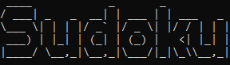
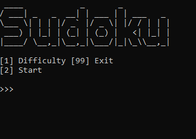
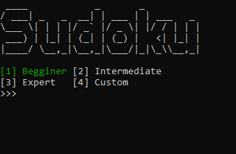
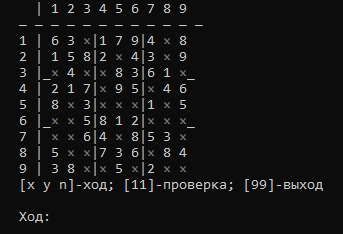
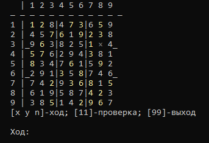
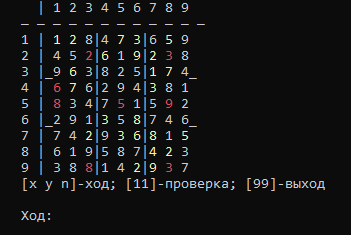
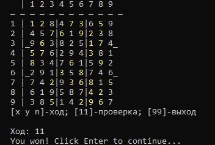

Sudoku in Terminal
====

Это консольная игра в Судоку, написанная на Python. Игра позволяет пользователю выбирать уровень сложности, генерировать новую игровую доску и проверять правильность введенных решений. 

Написано в качестве пет-проекта за несколько дней

### Что внутри?
- **Генерация доски**
    - **1.** Доска заполняется случайными числами
    - **2.** Доска полностью прорешивается скриптом(для проверки ее возможности)
    - **3.** Из доски случайным образом убираются числа
- **Проверка уникальности решения у доски**
    - у доски может быть только одно решение
- **Вывод доски в терминал**
    - интерфейс понятен для игры
- **Ввод чисел с указанием координат ячейки**
    - чтобы ввести число необходимо указать его координаты и значение
- **Проверка решения игрока**
    - **1.** Проверка уникальности чисел каждой строке, колонке, диагонали
    - **2.** Подсветка неверно вписанных чисел красным цветом

### Как играть?

##### Выбор сложности
Всего есть 4 вида сложности, которые определяют количество скрытых ячеек:
- **Beginner**: 30-40 скрытых ячеек.
- **Intermediate**: 40-50 скрытых ячеек.
- **Expert**: 50-60 скрытых ячеек.
- **Custom**: введите желаемое количество скрытых ячеек.

##### Игровой процесс

- **__Ходы:__** вводятся в формате **[x y n]**, где *x* и *y* - координаты ячейки от 1 до 9 по горизонатали и вертикали
- **__Проверка:__**: для проверки решения необходимо ввести команду **11**, проверка работает только при полностью заполненном поле

### Скриншоты

|  |  |   |
|---------------------------------|---------------------------------|----------------------------------|
| Меню                            | Выбор сложности                 | Начало игры                      |

|  |  |  |
|-------------------------------------|-----------------------------------|-------------------------------|
| Заполнение полей                    | Подсветка ошибок при проверке     | Победа                        |
